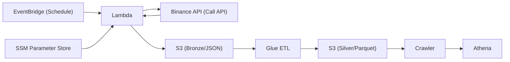

# CryptoFlow Pipeline

Serverless cryptocurrency data pipeline that collects, transforms, and analyzes real-time price data from Binance using AWS services.

[](https://opensource.org/licenses/MIT)
[](https://aws.amazon.com/)

## Architecture



**Key Components:**

- **Lambda**: Fetches kline data every hour via EventBridge
- **S3 Bronze**: Raw JSON storage with partitioning (exchange/symbol/date/hour)
- **Glue ETL**: Transforms to Parquet with incremental watermark processing
- **S3 Silver**: Optimized Parquet storage for analytics
- **Athena**: SQL queries on partitioned data

## Features

- ✅ Serverless architecture (Lambda, Glue, S3, Athena)
- ✅ Incremental processing with watermark tracking
- ✅ Partitioned storage for efficient queries
- ✅ Configurable via SSM Parameter Store
- ✅ Cost-optimized with Parquet compression

## Quick Start (AWS CLI)

### 1. Setup SSM Parameters

```bash
aws ssm put-parameter --name "/coin/binance/symbols" --value "BTCUSDT,ETHUSDT" --type String
aws ssm put-parameter --name "/coin/binance/interval" --value "1m" --type String
```

### 2. Deploy Lambda

```bash
pip install urllib3 -t ./package
cd package && zip -r ../lambda.zip . && cd ..
zip -g lambda.zip lambda_function.py

aws lambda create-function \
  --function-name crypto-ingestion \
  --runtime python3.11 \
  --role arn:aws:iam::ACCOUNT:role/LAMBDA_ROLE \
  --handler lambda_function.lambda_handler \
  --zip-file fileb://lambda.zip
```

### 3. Schedule with EventBridge

```bash
aws events put-rule --name crypto-schedule --schedule-expression "rate(1 hour)"
aws events put-targets --rule crypto-schedule --targets "Id"="1","Arn"="LAMBDA_ARN"
```

### 4. Deploy Glue Job

Upload `etl_s3_drop_invaild_field.py` to S3 and create Glue job via Console with:

- Worker: G.1X, 10 workers
- IAM role with S3 + SSM access

### 5. Create Crawler

Point crawler to `s3://coin-prices-bucket/silver/` and schedule after ETL runs.

## Data Schema

### Bronze (JSON)

```json
{
  "symbol": "BTCUSDT",
  "open": "42500.50",
  "high": "42800.00",
  "low": "42300.00",
  "close": "42650.25",
  "volume": "1250.45",
  "event_time": "2025-01-08T10:00:00+00:00"
}
```

### Silver (Parquet)

Adds `event_ts`, `event_date`, `hour` columns

## Query Examples

```sql
-- Latest prices
SELECT symbol, close, event_time
FROM silver_coin_data
WHERE event_date = date_format(current_date, '%Y-%m-%d')
ORDER BY event_time DESC;

-- 7-day average
SELECT symbol, AVG(close) as avg_price
FROM rawexchange_binance
WHERE event_date >= date_format(current_date - interval '7' day,'%Y-%m-%d')
GROUP BY symbol;
```

## Configuration

**Supported intervals**: `1m`, `5m`, `15m`, `1h`, `4h`, `1d`

Update anytime via SSM:

```bash
aws ssm put-parameter --name "/coin/binance/symbols" --value "BTCUSDT,ETHUSDT,SOLUSDT" --overwrite
```

### Development Environment

This project assumes VS Code as the primary IDE.
Lambda Layers are resolved locally via `python.analysis.extraPaths`.

## License

MIT License - see [LICENSE](LICENSE) file for details.
